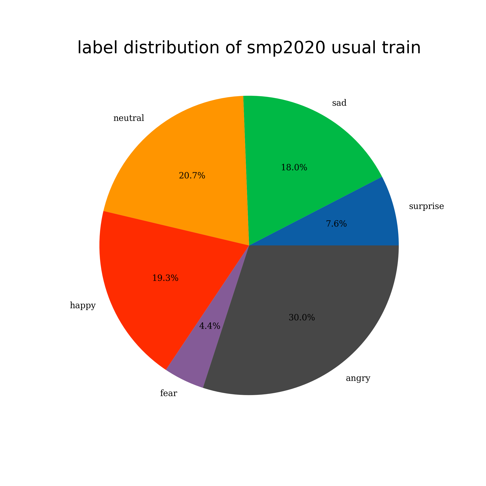
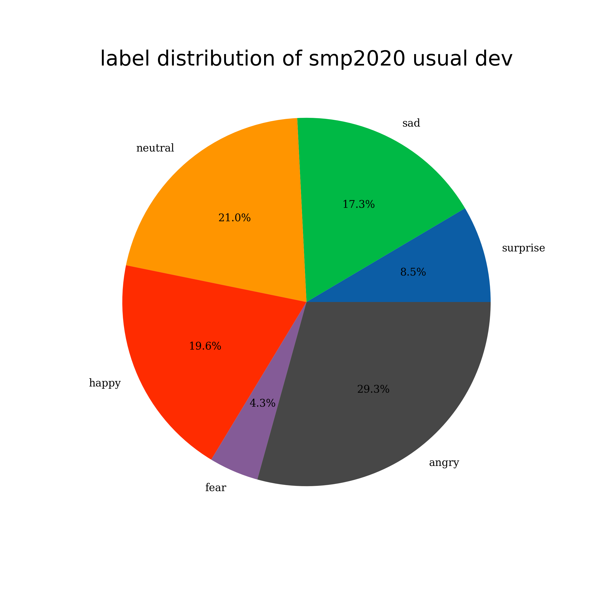
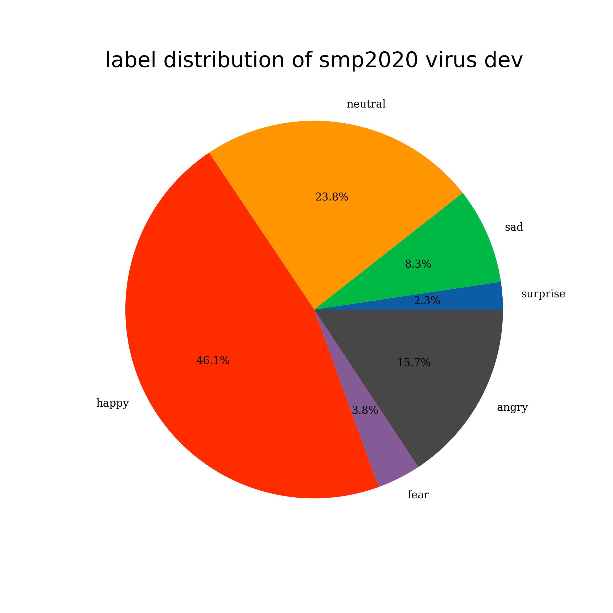
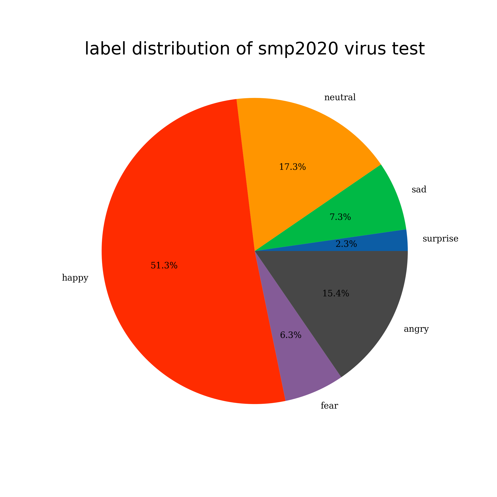

# 数据集介绍

未来将增加的benchmark
1. https://github.com/thu-coai/LOT-Benchmark
2. https://www.cluebenchmarks.com/index.html
3. https://gluebenchmark.com/
3. https://tianchi.aliyun.com/muge

目录

* 一、文本分类
* 二、阅读理解

## 一、文本分类

|       dataset       | language | num class |    type     | train  |  dev  | test  |                            source                            |
| :-----------------: | :------: | :-------: | :---------: | :----: | :---: | :---: | :----------------------------------------------------------: |
| smp2020-ewect-usual |    zh    |     6     | multi-class | 26,226 | 2,000 | 5,000 | [link](https://github.com/dbiir/UER-py/tree/master/datasets/smp2020-ewect) |
| smp2020-ewect-virus |    zh    |     6     | multi-class | 8,606  | 2,000 | 3,000 | [link](https://github.com/dbiir/UER-py/tree/master/datasets/smp2020-ewect) |


### 1. [smp2020-ewect-usual](https://smp2020ewect.github.io/) 

```json
{
    0: "neutral",
    1: "angry",
    2: "happy",
    3: "sad",
    4: "fear",
    5: "surprise"
}
```


|                            text_a                            | label |
| :----------------------------------------------------------: | :---: |
|     无论是心情多么低沉的夜晚，天光大亮后都是崭新的开始。     |   0   |
|               所以注定我这辈子是做不了商人妈蛋               |   1   |
|      小紧张~不过美美羊和圆圆媛要去看我表演，好开森啊！       |   2   |
|                帽子怎么就变绿色幸好只是试一下                |   3   |
| 尼玛吓死我了，人家剪个头发回来跟劳改犯一样短的可怕，后面什么鬼[黑线] [黑线] [黑线] [白眼] [白眼] |   4   |
|            棉花一枝独秀？难道看不见服装业的形势？            |   5   |

<table><tr>
    <td> </td>
    <td> </td>
    <td> </td>
    </tr></table>

<table><tr>
    <td>  </td>
    <td>  </td>
    <td>  </td>
    </tr></table>


### 2. [smp2020-ewect-virus](https://smp2020ewect.github.io/) 

```json
{
    0: "neutral",
    1: "angry",
    2: "happy",
    3: "sad",
    4: "fear",
    5: "surprise"
}
```

|                            text_a                            | label |
| :----------------------------------------------------------: | :---: |
|                      除夕夜，他们在武汉                      |   0   |
| 没错！平时说上海样样不好，出事了都往上海跑，上海都往外输出救助资源。等事情过了也不会对上海人改变看法……上海人有做什么事上不了台面了？！ |   1   |
|        [心] [鲜花] [作揖] [赞]//@针灸匠张宝旬:榜样。         |   2   |
|                        最后一句心疼了                        |   3   |
| 我们公司怎么还没发有关这次的通知啊，就希望湖北回来的员工先自行隔离两周，没事的话再来上班不然这样我也很害怕… ?? |   4   |
| 万万没想到出来玩居然是买这些东西回家！！！#新型冠状病毒##武汉加油# http://t.cn/RyhQMjB ??泰国·PhuketIsland |   5   |

<table><tr>
    <td> </td>
    <td> </td>
    <td> </td>
    </tr></table>

<table><tr>
    <td>  </td>
    <td>  </td>
    <td>  </td>
    </tr></table>


## 二、阅读理解

### 1. 抽取型阅读理解-cmrc2018

leaderboard：https://ymcui.com/cmrc2018/

| | Train | Dev | Test |
|:---:| :---:|:---:|:---:|
| Question | 10,321 | 3,351 | 4,895 |
| Answer per Q | 1 | 3 | 3 |
| Max P tokens | 962 | 961 | 980 |
| Max Q tokens | 89 | 56 | 50 |
| Max A tokens | 100 | 85 | 92 |
| Avg P tokens | 452 | 469 | 472 |
| Avg Q tokens | 15 | 15 | 15 |
| Avg A tokens | 17 | 9 | 9 |

数据格式：

````json
{
    "version": "v1.0",
    "data":[
        {
            "title": "战国无双3",
            "id": "DEV_0", 
            "paragraphs": [
                {
                    "id": "DEV_0",
                    "context": "《战国无双3》（）是由光荣和ω-force开发的战国无双系列的正统第三续作。xxx",
                    "qas":[
                        {
                            "question": "《战国无双3》是由哪两个公司合作开发的？",
                            "id": "DEV_0_QUERY_0", 
                            "answers": [
                                {
                                    "text": "光荣和ω-force",
                                    "answer_start": 11
                                },
                                ...
                            ]
                        },
                                ...
                    ]
                },
                        ...
            ]
        },
                        ...
    ]
}
````

