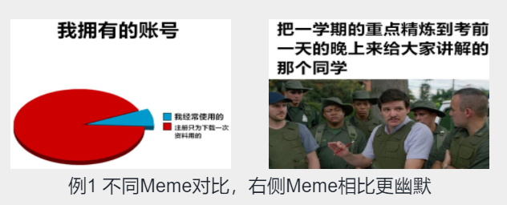
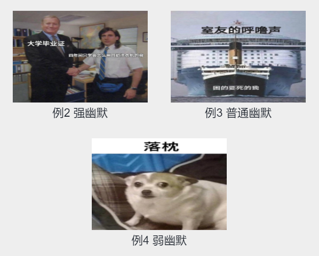

# 2021CCL-“小牛杯”图文多模态幽默识别评测

* 任务简介：

  * 梗图（Meme）由图片和对应的文本组成，以图文结合的方式形成幽默效果，其中文本一般是对图片的注释或曲解。本次评测基于Meme数据集进行图文多模态幽默识别，包含两个任务。任务一：Meme幽默程度比较；任务二：Meme幽默等级划分。
  * 官网：http://cips-cl.org/static/CCL2021/cclEval/humorcomputation/index.html 

* 时间：2021.4~2021.7

* 数据示例

  > 任务一：Meme幽默程度比较 ：本任务要求参赛系统对给定的两个Meme进行幽默程度的比较，从中选出两者中更幽默的Meme。

  

  > 任务二：Meme幽默等级划分：要求参赛系统对给出的单个Meme进行分析，预测该Meme的幽默等级。

  

* 数据说明

  > 注：两者训练集相同

  |  数据集   | 任务一 | 任务二 |                             下载                             |
  | :-------: | :----: | :----: | :----------------------------------------------------------: |
  |  训练集   |  3000  |  3000  | [√](https://github.com/HumorComputing/CCL2021-Humor-Computation/tree/master/train_data) |
  | A榜测试集 |  500   |  500   | [√](https://github.com/HumorComputing/CCL2021-Humor-Computation/tree/master/dev_data) |
  | B榜测试集 |  1000  |  1000  | [√](https://github.com/HumorComputing/CCL2021-Humor-Computation/tree/master/test_data) |

  

* 竞赛方案

  > 最终指标=任务一F1 + 任务二F1

  | 方案                                                         |                           汇报题目                           | 指标  | 代码 |
  | ------------------------------------------------------------ | :----------------------------------------------------------: | :---: | :--: |
  | [4](https://hub.baai.ac.cn/views/12742#mcetoc_1fmalub9qk) (2:38:24~2:58:30) |   一种基于预训练模型的多模态幽默识别方法，韩超（云南大学）   | 1.130 |  ×   |
  | [5](https://hub.baai.ac.cn/views/12742#mcetoc_1fmalub9qk) (2:59:05~3:10:30) | 基于Transformer编码器的多模态幽默识别方法，李振（哈尔滨工业大学） | 1.090 |  ×   |
  | [6](https://hub.baai.ac.cn/views/12742#mcetoc_1fmalub9qk) (3:31:10~3:44:10) |    一种基于Bert模型的幽默识别方法，吴绍武（南方科技大学）    | 0.995 |  ×   |
  | [3](https://hub.baai.ac.cn/views/12742#mcetoc_1fmalub9qk) (3:11:25~3:29:30) | 多预训练模型集成的数据增强图文幽默识别，耿源羚（大连理工大学） | 1.198 |  ×   |
  | [2](https://hub.baai.ac.cn/views/12742#mcetoc_1fmalub9qk) (3:44:50~4:01:30) |     一种基于多模态集成学习的幽默识别方法，陈佳豪(好未来)     | 1.308 |  ×   |
  | [1](https://hub.baai.ac.cn/views/12742#mcetoc_1fmalub9qk) (4:02:00~4:21:20) | A Simple Approach for Humor Classification on Memes using Transfer Learning，陈雨涛（北京理工大学） | 1.403 |  ×   |

  

* 推荐资料

  [评测总结](https://hub.baai.ac.cn/views/12742#mcetoc_1fmalub9qk)（2:29:40~2:37:40）

